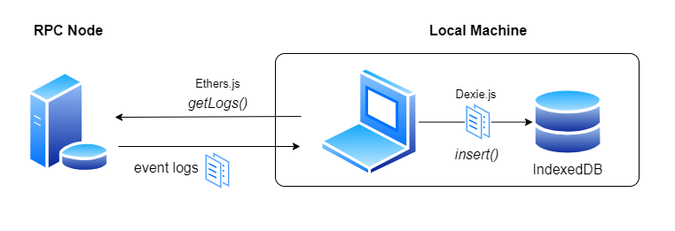
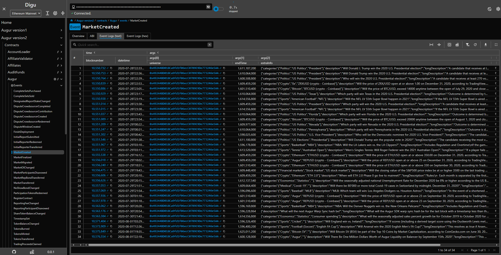

# **Digu**

## [**Quick start** ](#quick-start)

If you want to use Digu right away, open this site:

**https://snjro.github.io/digu/**

## [**Overview** ](#overview)

Digu is a user interface to view [smart contracts](https://ethereum.org/en/developers/docs/smart-contracts/) for [Augur](https://github.com/AugurProject). You can browse contract data such as [ABI](https://docs.soliditylang.org/en/develop/abi-spec.html), creation info, [functions](https://ethereum.org/en/developers/docs/smart-contracts/anatomy/#functions), [events](https://ethereum.org/en/developers/docs/smart-contracts/anatomy/#events-and-logs) in detail.
If you have a [RPC endpoint](https://ethereum.org/en/developers/docs/apis/json-rpc/) URL, Digu can retrieve the event logs emitted by contracts.

- **Semi-Serverless:**  
  Digu is a standalone application, basically it runs without a server. Only when using RPC to get event logs, it connects remote environment. And these event logs are all stored on your local database.
- **Zero personal data collection:**  
  Digu does _NOT_ collect any personal information. All data that requires preservation such as preferance, settings, RPC endpoint URL you set are stored locally.

## [How it works](#how-it-works)

without a connection to the RPC endpoint, Digu has fundamental data about blockchains and contracts. So even if you don't have an RPC endpoint, you can still browse those information.
But if you provide Digu with an RPC endpoint, Digu will use it to retrieve and list event logs emitted by the contracts. These logs are stored in your local browser database called [`IndexedDB`](https://developer.mozilla.org/en-US/docs/Web/API/IndexedDB_API).

The main libraries that are used to achieve this are:

- [**Ethers.js**](https://github.com/ethers-io/ethers.js): Interacting with RPC endpoint
- [**Dexie.js**](https://dexie.org/): Interacting with `IndexedDB`
- [**AG Grid**](https://www.ag-grid.com/): Displaying tabular data

 

As an example, you can view event logs like this: 

## Getting started

- [Getting started as user🔗](./docs/getting-started-as-user/README.md)
- [Getting started as developer🔗](./docs/getting-started-as-developer/README.md)
