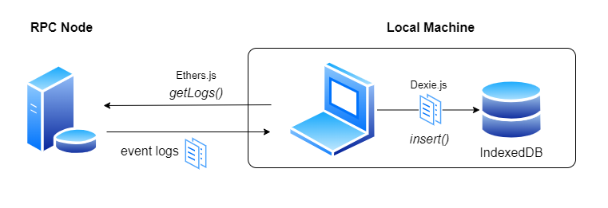
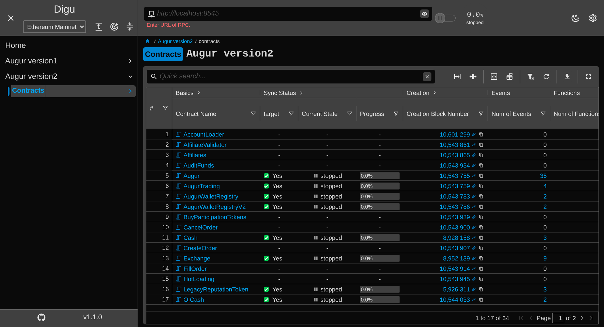

# **Digu**

## [**Quick start**](#quick-start)

If you want to use Digu right away, open this site:

**https://snjro.github.io/Digu/**

## [**Overview**](#overview)

Digu is a user interface to view [smart contracts](https://ethereum.org/en/developers/docs/smart-contracts/) for [Augur](https://github.com/AugurProject). You can browse contract data such as [ABI](https://docs.soliditylang.org/en/develop/abi-spec.html), creation info, [functions](https://ethereum.org/en/developers/docs/smart-contracts/anatomy/#functions), [events](https://ethereum.org/en/developers/docs/smart-contracts/anatomy/#events-and-logs) in detail.
Digu can import the event logs emitted by the contracts from a snapshot published with this site (warp sync, for Ethereum and Polygon now; it can be turned off for each chain in the settings). If you have a [RPC endpoint](https://ethereum.org/en/developers/docs/apis/json-rpc/) URL, Digu retrieves the event logs after the snapshot, or all of them. To get a URL, see [RPC endpoint URL](./docs/getting-started-as-user/README.md#rpc-endpoint-url).

- **Semi-Serverless:**  
  Digu is a standalone application, basically it runs without a server. It connects to a remote environment only to get event logs: the snapshot of the warp sync, which it reads from this same site (GitHub Pages), and the RPC endpoint you set. These event logs are all stored on your local database.
- **Zero personal data collection:**  
  Digu does _NOT_ collect any personal information. All data that requires preservation such as preference, settings, RPC endpoint URL you set are stored locally.

## [How it works](#how-it-works)

without a connection to the RPC endpoint, Digu has fundamental data about blockchains and contracts. So even if you don't have an RPC endpoint, you can still browse those information.
When you open a chain that has a snapshot, Digu imports the event logs of the snapshot (warp sync). The owner of Digu makes the snapshot with a public RPC endpoint and [`scripts/warp-sync/build-snapshot.mjs`](./scripts/warp-sync/README.md), and publishes it with this site. The snapshot has the logs as the RPC endpoint returned them, and Digu decodes them in your browser in the same way as the logs it retrieves itself.
If you provide Digu with an RPC endpoint, Digu will use it to retrieve and list event logs emitted by the contracts, after the end of the snapshot. These logs are stored in your local browser database called [`IndexedDB`](https://developer.mozilla.org/en-US/docs/Web/API/IndexedDB_API).

The main libraries that are used to achieve this are:

- [**Ethers.js**](https://github.com/ethers-io/ethers.js): Interacting with RPC endpoint
- [**Dexie.js**](https://dexie.org/): Interacting with `IndexedDB`
- [**AG Grid**](https://www.ag-grid.com/): Displaying tabular data

 

For example, the contracts of a version look like this: 

## Getting started

- [Getting started as user🔗](./docs/getting-started-as-user/README.md)
- [Getting started as developer🔗](./docs/getting-started-as-developer/README.md)
