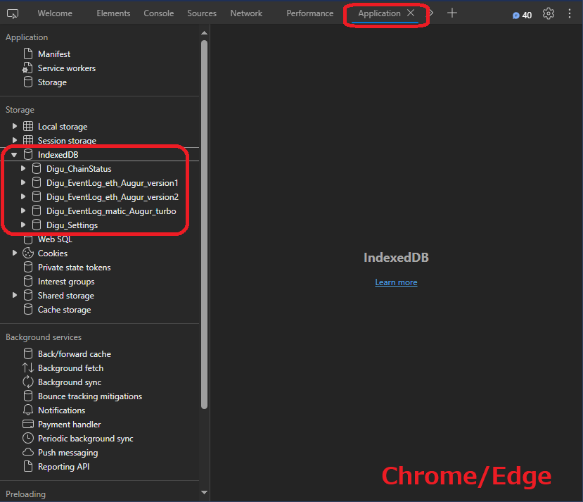
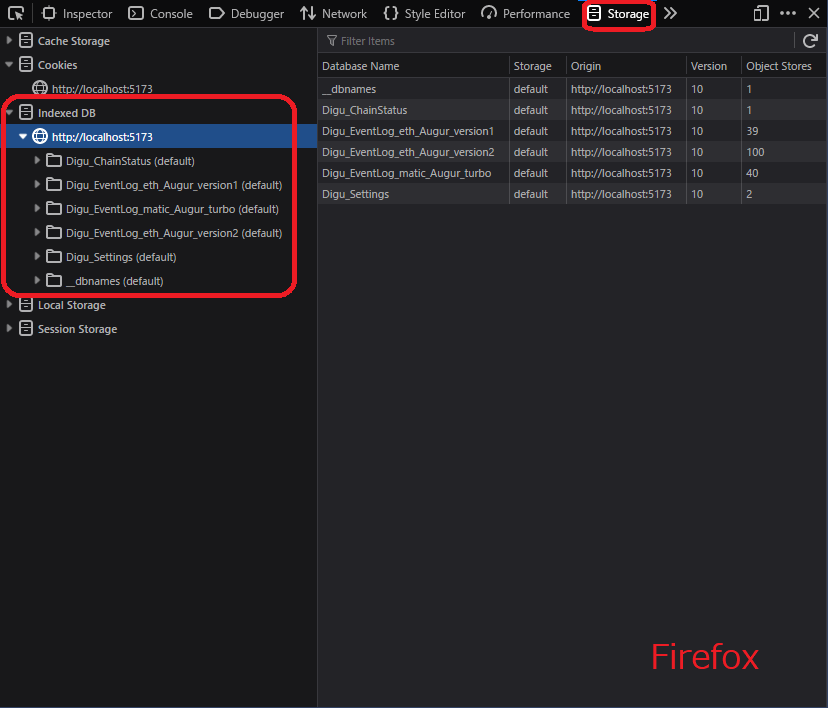

# **Getting started as developer**<!-- omit in toc -->

Digu uses the framework [`Svelte`](https://svelte.dev/) and [`SvelteKit`](https://kit.svelte.dev/) for developing the web application, and uses [`Tauri`](https://tauri.app/) which build a desktop app from the source for a web app.

Do the following steps/commands depending on what you want to do:

- [**Installation**](#installation)
- [**Starting a development server**](#starting-a-development-server)
- [**Building the application**](#building-the-application)
- [**Testing**](#testing)
- [**Quality Checks**](#quality-checks)
- [**Accessing the database**](#accessing-the-database)

## [**Installation**](#installation)

Run the following command to install the necessary dependencies:

```bash
npm install
```

## [**Starting a development server**](#starting-a-development-server)

Build web/desktop application for **development** using the following scripts.

- For the **WEB** application:

  ```bash
  npm run dev
  ```

  This launches the development server and compiles the web application.

- For the **WEB** and **DESKTOP** application:

  ```bash
  npm run tauri dev
  ```

  This works the same as `npm run dev`, plus compiles the desktop application.

## [**Building the application**](#building-the-application)

Build web/desktop application for deployment using the following scripts.

- For the **WEB** application:

  ```bash
  npm run build
  ```

- For the **WEB** and **DESKTOP** application:

  ```bash
  npm run tauri build
  ```

  The deploy directories are:  
  |Application|Path from the root|
  |:---------:|------------------|
  |Web|`./_build`|
  |Desktop|`./src-tauri/target/release`|

## [**Testing**](#testing)

Execute tests using the following scripts.

- To run all unit tests:
  ```bash
  npm run vitest
  ```
- To run all unit tests with coverage:

  ```bash
  npm run vitest:coverage
  ```

- To run all unit tests and display their results on the UI with coverage:

  ```bash
  npm run vitest:ui
  ```

- To run all E2E tests:
  ```bash
  npm run playwright-test
  ```

## [**Quality Checks**](#quality-checks)

Perform quality checks and maintenance tasks:

- To check the code and perform formatting:
  ```bash
  npm run check
  ```
- To watch for changes and perform checks:
  ```bash
  npm run check:watch
  ```
- To lint and format the code:
  ```bash
  npm run lint
  npm run format
  ```
- To print out all the unused exports in the source files
  ```bash
  npm run find-deadcode
  ```

## [**Accessing the database**](#accessing-the-database)

If you are curious about how your settings and event logs are sotred in the database, use [`developer tools`](https://developer.mozilla.org/en-US/docs/Learn/Common_questions/Tools_and_setup/What_are_browser_developer_tools) to access and view them.

---

<font color="#f39c12">**⚠ CAUTION ⚠**</font>  
 <font color="#f39c12"><b>NEVER EDIT THE VALUES ON THE DATABASE<b></font> with [`developer tools`](https://developer.mozilla.org/en-US/docs/Learn/Common_questions/Tools_and_setup/What_are_browser_developer_tools). It could cause Digu to stop working.

---

The Steps:

1. **Open the app**  
   Open Digu. Either the web/desktop app can be used.

2. **Open `developer tools`**  
   Press following keys to open `developer tools`:
   |OS|Pressing Keys|
   |:-:|:----------:|
   |Windows/Linux|<kbd>Ctrl</kbd> + <kbd>Shift</kbd> + <kbd>i</kbd>|
   |macOS|<kbd>Cmd</kbd> + <kbd>Option</kbd> + <kbd>i</kbd>|

3. **Select the tab that displays IndexedDB**  
   |Browser|Tab Name|
   |:-----:|:------:|
   |Chrome/Edge|`Application`|
   |Firefox|`Storage`|

4. **Access IndexedDB**  
   Look for `Storage` in the left panel, and click it to expand. Then you can see the database for Digu.<br>
   All database names for Digu begin with `Digu_`.
   <p float="left">
      
      
   </p>
