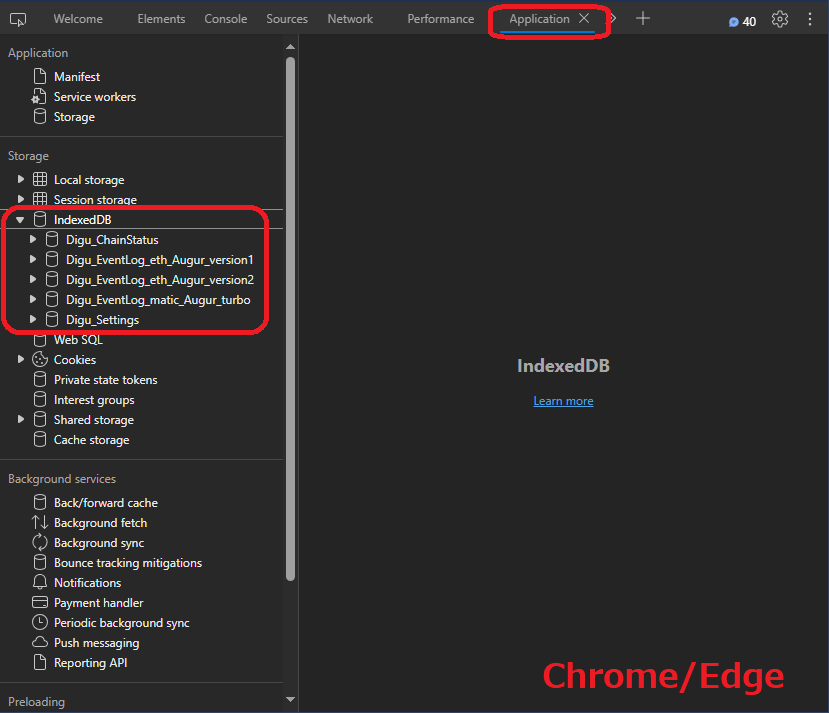
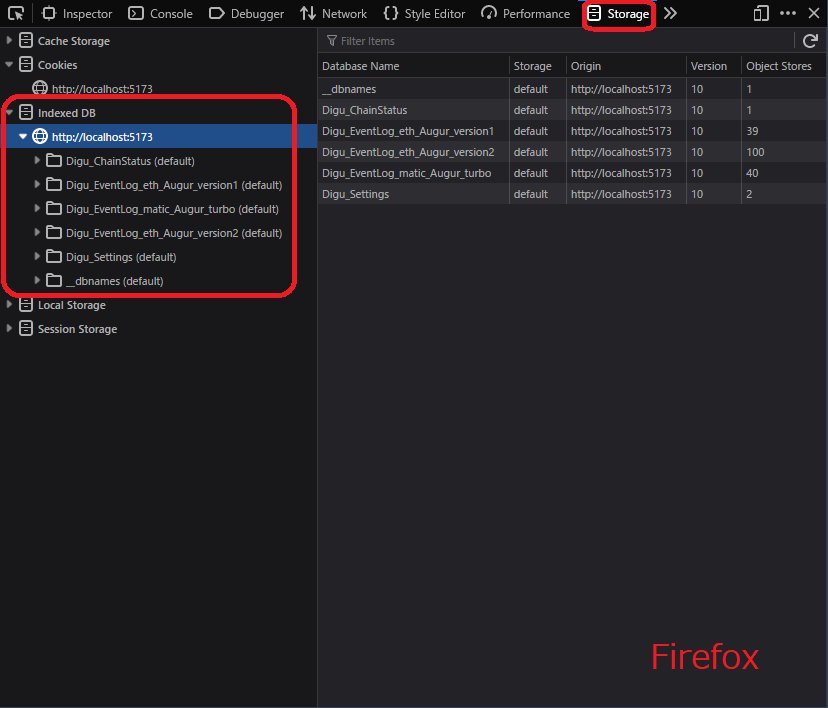

# **Getting started as developer**<!-- omit in toc -->

Digu uses the framework [`Svelte`](https://svelte.dev/) and [`SvelteKit`](https://kit.svelte.dev/) for developing the web application.

Do the following steps/commands depending on what you want to do:

- [**Installation**](#installation)
- [**Using Docker**](#using-docker)
- [**Starting a development server**](#starting-a-development-server)
- [**Building the application**](#building-the-application)
- [**Testing**](#testing)
- [**Quality Checks**](#quality-checks)
- [**Accessing the database**](#accessing-the-database)

## [**Installation**](#installation)

Digu is developed with Node.js 24, the version of the `app` service in `compose.yaml`. Run the following command to install the dependencies in `package-lock.json`:

```bash
npm ci
```

## [**Using Docker**](#using-docker)

If Node.js is not installed on your machine, you can run the npm scripts in a Docker container with `compose.yaml`.

- To install the dependencies:
  ```bash
  docker compose run --rm app npm ci
  ```
- To start the development server at `http://127.0.0.1:5173/`:
  ```bash
  docker compose up
  ```
- To run any other script, pass it to `docker compose run`:

  ```bash
  docker compose run --rm app npm run vitest
  ```

- The unit tests run in the `app` service as above. The `test` service, whose image includes Chrome, is for `scripts/visual-compare` and `scripts/a11y-scan`. It runs the tests too:
  ```bash
  docker compose run --rm test npx vitest run
  ```

Note: The `test` service uses the Puppeteer image and needs `SYS_ADMIN` because Chrome's sandbox cannot start in a container without it. Keep its image tag the same as the `puppeteer` version in `package-lock.json`.

## [**Starting a development server**](#starting-a-development-server)

Start the development server using the following script.

```bash
npm run dev
```

This launches the development server and compiles the web application.

## [**Building the application**](#building-the-application)

Build the web application for deployment using the following script.

```bash
npm run build
```

The deploy directory is `./_build`.

## [**Testing**](#testing)

Execute tests using the following scripts.

- To run all unit tests:
  ```bash
  npm run vitest
  ```
- To run all unit tests with coverage:

  ```bash
  npm run vitest:coverage
  ```

- To run all unit tests and display their results on the UI with coverage:

  ```bash
  npm run vitest:ui
  ```

## [**Quality Checks**](#quality-checks)

Perform quality checks and maintenance tasks:

- To check the types and the Svelte components (it does not format the code):
  ```bash
  npm run check
  ```
- To watch for changes and perform checks:
  ```bash
  npm run check:watch
  ```
- To check the formatting with Prettier, then lint with ESLint. It rewrites the files where ESLint can fix a problem (`eslint --fix`), and it does not run ESLint when the Prettier check fails:
  ```bash
  npm run lint
  ```
- To format the code with Prettier:
  ```bash
  npm run format
  ```
- To check the code without changing it, as CI does:
  ```bash
  npx prettier --check --plugin prettier-plugin-svelte .
  npx eslint .
  ```

## [**Accessing the database**](#accessing-the-database)

If you are curious about how your settings and event logs are stored in the database, use [`developer tools`](https://developer.mozilla.org/en-US/docs/Learn/Common_questions/Tools_and_setup/What_are_browser_developer_tools) to access and view them.

---

<font color="#f39c12">**⚠ CAUTION ⚠**</font>  
<font color="#f39c12"><b>NEVER EDIT THE VALUES ON THE DATABASE<b></font> with [`developer tools`](https://developer.mozilla.org/en-US/docs/Learn/Common_questions/Tools_and_setup/What_are_browser_developer_tools). It could cause Digu to stop working.

---

The Steps:

1. **Open the app**  
   Open Digu.

2. **Open `developer tools`**  
   Press following keys to open `developer tools`:

   |      OS       |                   Pressing Keys                   |
   | :-----------: | :-----------------------------------------------: |
   | Windows/Linux | <kbd>Ctrl</kbd> + <kbd>Shift</kbd> + <kbd>i</kbd> |
   |     macOS     | <kbd>Cmd</kbd> + <kbd>Option</kbd> + <kbd>i</kbd> |

3. **Select the tab that displays IndexedDB**

   |   Browser   |   Tab Name    |
   | :---------: | :-----------: |
   | Chrome/Edge | `Application` |
   |   Firefox   |   `Storage`   |

4. **Access IndexedDB**  
   Look for `Storage` in the left panel, and click it to expand. Then you can see the database for Digu.<br>
   All database names for Digu begin with `Digu_`.
   <p float="left">
      
      
   </p>
