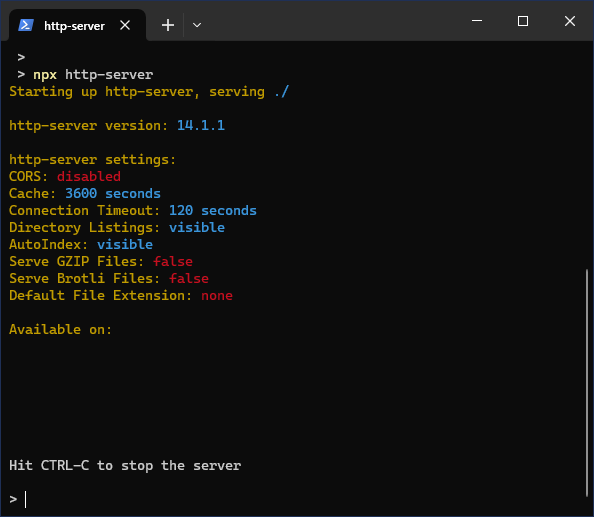

# **Getting started as user**<!-- omit in toc -->

## [**Quick start** ](#quick-start)<!-- omit in toc -->

Open **https://snjro.github.io/digu/** to use Digu immediately

## [**Index**](#index)<!-- omit in toc -->

There are two ways to use Digu as a user:

- [**Web application** (Need a server)](#web-application-need-a-server)
  - [Using Digu with `GitHub Pages`](#using-digu-with-github-pages)
  - [Using Digu with `Visual Studio Code`](#using-digu-with-visual-studio-code)
  - [Using Digu with `Node.js`](#using-digu-with-nodejs)
- [**Desktop application** (Need to install)](#desktop-application-need-to-install)

## [**Web application** (Need a server)](#web-application-need-a-server)

To use Digu without installing, **you need (to set up) a server**. Digu is a semi-serverless application, it should start with opening a html file on your local environment with a browser in theory. However, it won’t work due to the violation of [Same-Origin Policy](https://developer.mozilla.org/en-US/docs/Web/Security/Same-origin_policy).
To comply this policy, you need to use Digu with a server. I suggest the folowing methods, choose the one you prefer:
|#|Method|Dificulty|
|-|------|---------|
|1|[Using GitHub Pages](#using-digu-with-github-pages)|easy|
|2|[Using `Visual Studio Code`](./docs/webApplication/vsCode/README.md)|technical|
|3|[Using `Node.js`](./docs/webApplication/nodejs/README.md)|technical|

### [Using Digu with `GitHub Pages`](#using-digu-with-github-pages)

This method uses [`GitHub Pages`](https://docs.github.com/en/pages/getting-started-with-github-pages/about-github-pages). It hosts the files in the `/_build` folder in this repository. You can access it from [https://snjro.github.io/digu/](https://snjro.github.io/digu/).

### [Using Digu with `Visual Studio Code`](#using-digu-with-visual-studio-code)

This method uses `Visual Studio Code` (`VSCode`) and its extention [`Live Server`](https://marketplace.visualstudio.com/items?itemName=ritwickdey.LiveServer) to set up a local server for using Digu.

The steps:

1. **Download deploy directory**  
   Download the directory `./_build` that is the deploy directory for the web application.

2. **Install `VSCode`**  
   Download VSCode from [the official site](https://code.visualstudio.com/download) and install it.
3. **Open the downloaded folder on VSCode**

   1. Open `VSCode`.
   2. Click `File > Open Folder...` in the menu bar at the top on VSCode.
   3. Select the folder that you downloaded in the 1st step.
   4. The contents of the folder are displayed in the Explorer on the sidebar of VSCode.  
      

4. **Install the extention `Live Server`**

   1. Go to the Extensions view by clicking on the Extensions icon in the Activity Bar on the side of the window.
   2. In the Extensions view search bar, type `Live Server` and install it.  
      

5. **Start Live Server**
   1. To start `Live Server`, click on `Go Live` that is on a status bar at the bottom of VSCode.
      

Then, Your local server is started at port: `5500`.<br>Digu will show up in your default browser with URL `http://127.0.0.1:5500/` or `http://localhost:5500/`.

### [Using Digu with `Node.js`](#using-digu-with-nodejs)

This method uses `Node.js` and and its extention [`Live Server`](https://marketplace.visualstudio.com/items?itemName=ritwickdey.LiveServer) to set up a local server for using Digu.

The steps:

1. **Download deploy directory**  
   Download the directory `./_build` that is the deploy directory for the web application.
   As an example, assume that the downloaded folder `_build` is place under the `D:\digu`. Then, the directory path would be `D:\digu\_build`

2. **Install `Node.js`**  
   Download Node.js from [the official site](https://nodejs.org/en) and install it.

3. **Navigate to the downloaded folder**  
   In your terminal, run this command to navigate to the directory `D:\digu\_build`:

   ```bash
   cd D:\digu\_build
   ```

4. **Run `http-server` by npx**  
   In your terminal, run this command to run `http-server`:

   ```bash
   npx http-server
   ```

   Then, `http-server` has started like this:  
   

   Visit `http://localhost:8080` with your browser to view Digu.

## [**Desktop application** (Need to install)](#desktop-application-need-to-install)

To use Digu as an desktop app, **you need to install** it. Download the latest installer from [the release page](https://github.com/snjro/digu/releases) and install it. Choose the right one for the OS you are using:
|OS |Installer<br>(`x.x.x` is a version name)|Supported Platform|
|:-:|----------------------------------------|-------------------|
|Windows|Digu\_`x.x.x`\_x64-setup.**exe** |`Windows 7` and above |
|Linux |digu\_`x.x.x`\_amd64.**AppImage** |`Ubuntu 18.04` and above|
|macOS |Digu\_`x.x.x`\_x64.**dmg** |`macOS 10.15` and above|😞|

<!-- Supported Platform: https://github.com/tauri-apps/tauri?tab=readme-ov-file#platforms -->
